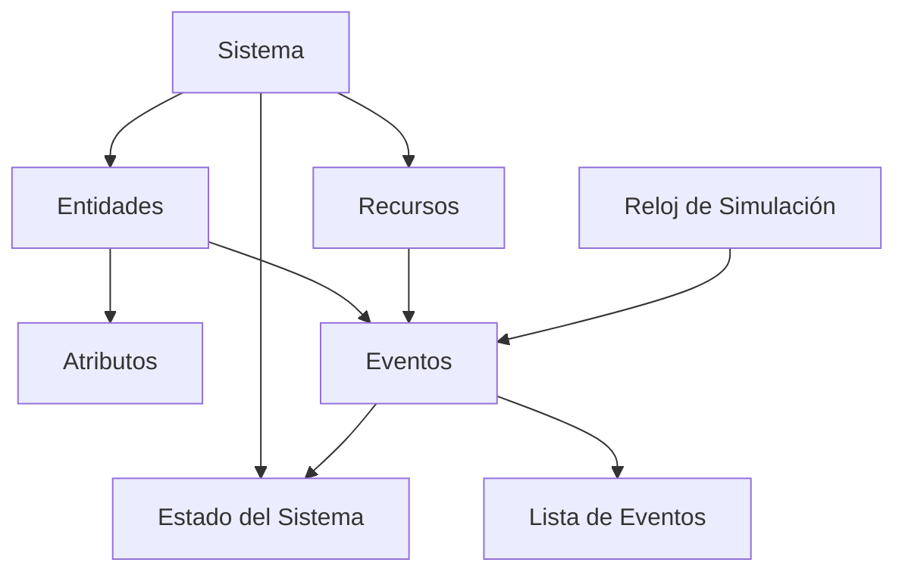

# 1.2 Conceptos básicos de la simulación

Para comprender y desarrollar modelos de simulación efectivos, es fundamental dominar un conjunto de conceptos y terminología estándar. Estos conceptos forman el lenguaje común que utilizan los profesionales de la simulación.

---

## 1. Sistema

**Definición:** Un conjunto de entidades (objetos, componentes) que interactúan entre sí de manera organizada para lograr un objetivo común.

**Características:**
- Tiene fronteras definidas (qué está dentro y qué está fuera)
- Posee entradas y salidas
- Evoluciona en el tiempo
- Puede ser abierto (intercambia con el entorno) o cerrado

**Ejemplos:**

| Sistema | Entidades | Objetivo |
|---------|-----------|----------|
| Banco | Clientes, cajeros, gerentes | Procesar transacciones |
| Aeropuerto | Aviones, pasajeros, puertas | Gestionar vuelos |
| Hospital | Pacientes, médicos, camas | Brindar atención médica |
| Fábrica | Máquinas, operarios, materiales | Producir bienes |
| Red de computadoras | Servidores, routers, paquetes | Transmitir datos |

**Fronteras del sistema:**
- **Dentro:** Lo que se modela explícitamente
- **Fuera:** El entorno que afecta al sistema pero no se modela en detalle

**Ejemplo detallado - Sistema bancario:**
- **Dentro:** Cajas de atención, cola de clientes, cajeros
- **Fuera:** Origen de los clientes, destino después del servicio

---

## 2. Modelo

**Definición:** Una representación abstracta y simplificada de un sistema real que captura sus características esenciales.

**Tipos de modelos:**

### Modelos Físicos
Representaciones tangibles a escala (maquetas, prototipos)
- **Ejemplo:** Túnel de viento para probar aerodinámica

### Modelos Matemáticos
Representaciones mediante ecuaciones y fórmulas
- **Ejemplo:** $\lambda = \frac{1}{\mu}$ (teoría de colas)

### Modelos de Simulación
Representaciones computacionales que imitan el comportamiento
- **Ejemplo:** Simulación de tráfico vehicular en software

**Niveles de abstracción:**

```
Sistema Real (Complejidad total)
    ↓
Modelo Conceptual (Diagrama de flujo)
    ↓
Modelo Computacional (Código)
    ↓
Resultados (Estadísticas)
```

---

## 3. Entidad

**Definición:** Un objeto de interés en el sistema que fluye a través de él y cuyo comportamiento se desea estudiar.

**Características:**
- Dinámica (se mueve, cambia de estado)
- Tiene atributos propios
- Puede ser temporal (creada y destruida)

**Ejemplos por industria:**

| Industria | Entidades Típicas |
|-----------|-------------------|
| Manufactura | Piezas, productos, pallets |
| Servicios | Clientes, documentos, llamadas |
| Salud | Pacientes, ambulancias, muestras de laboratorio |
| Logística | Contenedores, camiones, pedidos |
| Telecomunicaciones | Paquetes de datos, llamadas, mensajes |

**Ciclo de vida de una entidad:**

1. **Creación:** La entidad entra al sistema
2. **Procesamiento:** Pasa por diferentes estaciones
3. **Espera:** Puede estar en colas
4. **Destrucción:** Sale del sistema

**Ejemplo - Cliente en un banco:**
```
Creación: Llega al banco (t=0)
    ↓
Espera: Entra a la cola (t=0 a t=5 min)
    ↓
Procesamiento: Es atendido en caja (t=5 a t=8 min)
    ↓
Destrucción: Sale del banco (t=8 min)
```

---

## 4. Atributo

**Definición:** Una propiedad o característica de una entidad que la distingue de otras.

**Tipos de atributos:**

### Atributos Estáticos
No cambian durante la simulación
- **Ejemplos:** Tipo de cliente (VIP, regular), prioridad de un pedido

### Atributos Dinámicos
Cambian conforme la entidad se mueve por el sistema
- **Ejemplos:** Tiempo de llegada, tiempo en cola, estado actual

**Ejemplos detallados:**

**Entidad: Cliente en banco**
- Tipo de transacción (depósito, retiro, consulta)
- Monto de la transacción
- Tiempo de llegada
- Prioridad (VIP, regular)
- Tiempo total en el sistema

**Entidad: Pieza en manufactura**
- Material (acero, aluminio, plástico)
- Dimensiones (largo, ancho, alto)
- Lote de producción
- Ruta de procesamiento
- Tiempo de procesamiento acumulado

**Uso en simulación:**
```python
class Cliente:
    def __init__(self, id, tiempo_llegada, tipo):
        self.id = id  # Atributo identificador
        self.tiempo_llegada = tiempo_llegada  # Atributo dinámico
        self.tipo = tipo  # Atributo estático (VIP/Regular)
        self.tiempo_inicio_servicio = None
        self.tiempo_salida = None
```

---

## 5. Estado del Sistema

**Definición:** El conjunto mínimo de variables necesarias para describir completamente el sistema en cualquier momento, relativo a los objetivos del estudio.

**Variables de estado típicas:**

### En sistemas de colas:
- Número de clientes en el sistema (N)
- Número de clientes en cola (Nq)
- Número de servidores ocupados (B)
- Estado de cada servidor (ocupado/libre)

### En sistemas de inventario:
- Nivel actual de inventario (I)
- Cantidad en orden (pendiente de llegar)
- Demanda acumulada no satisfecha

### En sistemas de manufactura:
- Número de piezas en cada estación
- Estado de cada máquina (operando/en falla/mantenimiento)
- Inventario en proceso (WIP)

**Ejemplo completo - Banco con 3 cajas:**

**Estado en t=10:30 AM:**
```
Estado del Sistema = {
    Clientes_en_cola: 7,
    Caja_1: OCUPADA (atendiendo cliente #45),
    Caja_2: OCUPADA (atendiendo cliente #46),
    Caja_3: LIBRE,
    Tiempo_simulación: 630 minutos
}
```

**Cambio de estado:**
Un evento (llegada de cliente o fin de servicio) causa transición de un estado a otro.

---

## 6. Evento

**Definición:** Una ocurrencia instantánea que puede cambiar el estado del sistema.

**Características:**
- Ocurre en un instante específico del tiempo
- Causa cambio en las variables de estado
- Puede programar eventos futuros

**Tipos de eventos:**

### Eventos Exógenos
Originados fuera del sistema
- **Ejemplo:** Llegada de un cliente

### Eventos Endógenos
Generados internamente por el sistema
- **Ejemplo:** Fin de servicio, falla de máquina

**Eventos típicos por sistema:**

| Sistema | Eventos Principales |
|---------|---------------------|
| Banco | Llegada de cliente, Inicio de servicio, Fin de servicio |
| Hospital | Llegada de paciente, Inicio de cirugía, Alta médica |
| Manufactura | Llegada de orden, Inicio de procesamiento, Fin de procesamiento, Falla de máquina |
| Call Center | Llegada de llamada, Inicio de atención, Fin de llamada, Abandono |

**Ejemplo - Secuencia de eventos en banco:**

```
t=0.0:  Evento: LLEGADA_CLIENTE (Cliente #1)
        Acción: Cliente entra a cola
        Nuevo estado: Cola = [#1], Cajas libres = 3

t=0.5:  Evento: INICIO_SERVICIO (Cliente #1, Caja 1)
        Acción: Cliente sale de cola, ocupa caja
        Nuevo estado: Cola = [], Cajas libres = 2
        Programa: FIN_SERVICIO en t=3.5

t=2.0:  Evento: LLEGADA_CLIENTE (Cliente #2)
        Acción: Cliente entra a cola
        Nuevo estado: Cola = [#2], Cajas libres = 2

t=2.5:  Evento: INICIO_SERVICIO (Cliente #2, Caja 2)
        Acción: Cliente sale de cola, ocupa caja
        Nuevo estado: Cola = [], Cajas libres = 1
        Programa: FIN_SERVICIO en t=5.0

t=3.5:  Evento: FIN_SERVICIO (Cliente #1, Caja 1)
        Acción: Cliente sale, caja queda libre
        Nuevo estado: Cola = [], Cajas libres = 2
```

---

## 7. Actividad

**Definición:** Un período de tiempo de duración conocida (determinística o estocástica) durante el cual una entidad está en un estado particular.

**Ejemplos:**
- Tiempo de servicio en una caja
- Tiempo de procesamiento de una pieza
- Tiempo de reparación de una máquina

**Diferencia con Evento:**
- **Evento:** Instantáneo (punto en el tiempo)
- **Actividad:** Tiene duración (intervalo de tiempo)

---

## 8. Reloj de Simulación

**Definición:** Variable que mantiene el tiempo actual de la simulación.

**Mecanismos de avance:**

### Avance de Tiempo Fijo (Time-Slicing)
El reloj avanza en incrementos constantes (Δt)
- **Ventaja:** Simple de implementar
- **Desventaja:** Ineficiente (revisa sistema aunque no haya cambios)

### Avance de Evento a Evento (Event-Driven)
El reloj salta al tiempo del próximo evento
- **Ventaja:** Eficiente (solo procesa cuando hay cambios)
- **Desventaja:** Más complejo de programar

**Ejemplo de avance por eventos:**
```
Reloj: 0.0 → 2.3 → 5.1 → 5.8 → 8.2 → ...
       ↑     ↑     ↑     ↑     ↑
    Inicio Llegada Fin  Llegada Fin
           Cliente Serv. Cliente Serv.
```

---

## 9. Lista de Eventos Futuros (Event Calendar)

**Definición:** Estructura de datos que mantiene todos los eventos programados, ordenados cronológicamente.

**Operaciones principales:**
1. **Insertar:** Agregar nuevo evento
2. **Extraer:** Obtener el próximo evento (el más cercano en el tiempo)
3. **Cancelar:** Eliminar un evento programado

**Ejemplo de lista de eventos:**

| Tiempo | Tipo de Evento | Entidad | Recurso |
|--------|----------------|---------|---------|
| 2.3 | LLEGADA | Cliente #2 | - |
| 3.5 | FIN_SERVICIO | Cliente #1 | Caja 1 |
| 5.1 | LLEGADA | Cliente #3 | - |
| 5.8 | FIN_SERVICIO | Cliente #2 | Caja 2 |

---

## 10. Recursos

**Definición:** Elementos del sistema que son requeridos por las entidades para realizar actividades y que tienen capacidad limitada.

**Tipos de recursos:**

### Recursos Permanentes
Siempre están en el sistema
- **Ejemplos:** Cajeros, máquinas, salas de operación

### Recursos Consumibles
Se agotan y deben reponerse
- **Ejemplos:** Materia prima, combustible, medicamentos

**Estados de un recurso:**
- **Libre (Idle):** Disponible para uso
- **Ocupado (Busy):** Siendo utilizado
- **Bloqueado (Blocked):** No disponible temporalmente
- **En falla (Failed):** Requiere reparación

---

## Relaciones Entre Conceptos



---

## Ejemplo Integrador: Sistema de Atención Médica

**Sistema:** Consultorio médico con 1 doctor

**Entidades:** Pacientes

**Atributos de pacientes:**
- ID del paciente
- Hora de llegada
- Tipo de consulta (urgente/regular)
- Tiempo de consulta requerido

**Recursos:**
- 1 Doctor (capacidad = 1)
- Sala de espera (capacidad = ilimitada)

**Estado del sistema:**
- Número de pacientes en espera
- Estado del doctor (libre/ocupado)
- Tiempo de simulación actual

**Eventos:**
- LLEGADA_PACIENTE
- INICIO_CONSULTA
- FIN_CONSULTA

**Actividades:**
- Tiempo entre llegadas (exponencial, media = 15 min)
- Tiempo de consulta (normal, media = 10 min, desv = 2 min)

**Simulación de 1 hora:**

```
t=0:    LLEGADA_PACIENTE #1
        Estado: Cola=[], Doctor=LIBRE
        Acción: Inicio inmediato de consulta
        Programa: FIN_CONSULTA en t=12

t=8:    LLEGADA_PACIENTE #2
        Estado: Cola=[], Doctor=OCUPADO
        Acción: Paciente entra a espera
        Estado: Cola=[#2], Doctor=OCUPADO

t=12:   FIN_CONSULTA #1
        Estado: Cola=[#2], Doctor=OCUPADO
        Acción: Paciente #1 sale, #2 inicia consulta
        Estado: Cola=[], Doctor=OCUPADO
        Programa: FIN_CONSULTA en t=21

t=18:   LLEGADA_PACIENTE #3
        Estado: Cola=[], Doctor=OCUPADO
        Acción: Paciente entra a espera
        Estado: Cola=[#3], Doctor=OCUPADO

...
```

---

## Importancia de Dominar Estos Conceptos

1. **Comunicación efectiva** con otros profesionales
2. **Diseño correcto** de modelos de simulación
3. **Interpretación adecuada** de resultados
4. **Documentación clara** de proyectos
5. **Aprendizaje** de software de simulación comercial

---

## Ejercicios Prácticos

### Ejercicio 1: Identificación de Conceptos

**Sistema:** Una cafetería con 2 baristas

Identifique:
- **Entidades:**
- **Atributos de las entidades:**
- **Recursos:**
- **Estado del sistema:**
- **Eventos posibles:**
- **Actividades:**

**Respuesta:**
- **Entidades:** Clientes
- **Atributos:** Tipo de bebida solicitada, tiempo de llegada, preferencia de tamaño
- **Recursos:** 2 baristas, máquina de café, caja registradora
- **Estado:** Número de clientes en cola, estado de cada barista (libre/ocupado), tiempo actual
- **Eventos:** Llegada de cliente, inicio de preparación, fin de preparación, pago completado
- **Actividades:** Tiempo de preparación de bebida, tiempo de pago

### Ejercicio 2: Modelado de Sistema

**Problema:** Un taller de reparación de automóviles tiene 3 mecánicos. Los autos llegan aleatoriamente y esperan en un estacionamiento si todos los mecánicos están ocupados.

**Tareas:**
1. Defina las fronteras del sistema
2. Liste todas las entidades
3. Identifique los atributos relevantes
4. Describa el estado del sistema
5. Liste todos los eventos posibles

**Respuesta sugerida:**

1. **Fronteras:**
   - Dentro: Estacionamiento de espera, 3 bahías de reparación, mecánicos
   - Fuera: Origen de los autos, destino después de reparación

2. **Entidades:** Automóviles

3. **Atributos:**
   - Marca y modelo
   - Tipo de reparación requerida
   - Tiempo de llegada
   - Prioridad (urgente/normal)
   - Tiempo estimado de reparación

4. **Estado del sistema:**
   - Número de autos en espera
   - Estado de cada mecánico (libre/ocupado)
   - Número de autos en reparación
   - Tiempo de simulación actual

5. **Eventos:**
   - LLEGADA_AUTO
   - INICIO_REPARACION
   - FIN_REPARACION
   - SALIDA_AUTO

### Ejercicio 3: Análisis de Eventos

**Escenario:** Sistema de atención telefónica con 5 agentes

**Secuencia de eventos:**
```
t=0:    Sistema inicia, 5 agentes libres
t=2:    Llamada #1 llega, asignada a Agente 1
t=3:    Llamada #2 llega, asignada a Agente 2
t=5:    Llamada #3 llega, asignada a Agente 3
t=6:    Llamada #1 termina, Agente 1 libre
t=7:    Llamada #4 llega, asignada a Agente 1
t=8:    Llamada #2 termina, Agente 2 libre
t=9:    Llamada #5 llega, asignada a Agente 2
```

**Preguntas:**
1. ¿Cuál es el estado del sistema en t=7.5?
2. ¿Cuántos agentes están ocupados en t=9?
3. ¿Cuál fue el tiempo de espera de la llamada #4?

**Respuestas:**
1. En t=7.5: 3 agentes ocupados (1, 2, 3), 2 libres (4, 5), 0 llamadas en espera
2. En t=9: 4 agentes ocupados (1, 2, 3, 4)
3. Llamada #4 no esperó (tiempo de espera = 0, fue atendida inmediatamente)

### Ejercicio 4: Diseño de Modelo Conceptual

**Sistema:** Biblioteca universitaria con servicio de préstamo de libros

**Requisitos:**
- Diseñe un modelo conceptual identificando todos los elementos básicos
- Cree un diagrama de flujo del proceso
- Defina las métricas de desempeño a medir

**Solución propuesta:**

**Elementos del modelo:**
- **Entidades:** Estudiantes
- **Atributos:** ID estudiante, tipo de usuario (pregrado/posgrado), número de libros solicitados
- **Recursos:** Bibliotecarios (2), sistema de cómputo (1)
- **Estado:** Estudiantes en cola, bibliotecarios ocupados/libres
- **Eventos:** Llegada estudiante, inicio de atención, fin de atención

**Métricas de desempeño:**
- Tiempo promedio de espera
- Tiempo promedio en el sistema
- Utilización de bibliotecarios
- Longitud máxima de cola
- Número de estudiantes atendidos por hora

---

## Casos de Estudio

### Caso 1: Optimización de Supermercado

**Contexto:** Un supermercado tiene 8 cajas registradoras pero solo abre 4 durante horas valle.

**Problema:** Los clientes se quejan de largas esperas durante ciertos períodos.

**Aplicación de conceptos:**

**Entidades:** Clientes con carritos de compras

**Atributos:**
- Número de artículos
- Método de pago (efectivo/tarjeta)
- Tiempo de llegada
- Tipo de cliente (rápido/normal)

**Estado del sistema:**
- Clientes en cada cola
- Cajas abiertas/cerradas
- Cajeros ocupados/libres

**Eventos clave:**
- Llegada de cliente
- Cliente elige cola
- Inicio de escaneo
- Fin de escaneo
- Inicio de pago
- Fin de pago

**Pregunta de investigación:** ¿Cuántas cajas deben estar abiertas en cada hora del día para mantener el tiempo de espera bajo 5 minutos?

### Caso 2: Centro de Llamadas de Emergencia

**Contexto:** Centro 911 recibe llamadas de emergencia que deben atenderse inmediatamente.

**Complejidad:** Diferentes tipos de emergencias (médica, policial, bomberos) requieren diferentes tiempos de atención.

**Elementos del modelo:**

**Entidades:** Llamadas de emergencia

**Atributos:**
- Tipo de emergencia
- Ubicación
- Severidad (alta/media/baja)
- Tiempo de llegada

**Recursos:**
- Operadores médicos (3)
- Operadores policiales (2)
- Operadores de bomberos (2)

**Eventos:**
- Llegada de llamada
- Clasificación de llamada
- Asignación a operador
- Inicio de atención
- Despacho de unidad
- Fin de llamada

**Métricas críticas:**
- Tiempo de respuesta (debe ser < 30 segundos)
- Llamadas abandonadas
- Utilización de operadores

---

## Errores Comunes al Definir Conceptos

### Error 1: Confundir Entidades con Recursos

❌ **Incorrecto:** "Los cajeros son entidades"
✅ **Correcto:** "Los cajeros son recursos, los clientes son entidades"

**Regla:** Las entidades fluyen por el sistema, los recursos permanecen.

### Error 2: Estado del Sistema Incompleto

❌ **Incorrecto:** Estado = {Número de clientes}
✅ **Correcto:** Estado = {Número en cola, Número en servicio, Estado de cada servidor, Tiempo actual}

**Regla:** El estado debe permitir reconstruir completamente la situación del sistema.

### Error 3: Confundir Eventos con Actividades

❌ **Incorrecto:** "El servicio es un evento"
✅ **Correcto:** "El servicio es una actividad; INICIO_SERVICIO y FIN_SERVICIO son eventos"

**Regla:** Los eventos son instantáneos, las actividades tienen duración.

### Error 4: Atributos Irrelevantes

❌ **Incorrecto:** Incluir "color de ojos del cliente" en modelo de banco
✅ **Correcto:** Incluir solo atributos que afecten el comportamiento del sistema

**Regla:** Solo incluir atributos que impacten las decisiones o métricas del modelo.

### Error 5: Fronteras Mal Definidas

❌ **Incorrecto:** Modelar todo el banco incluyendo estacionamiento, seguridad, bóveda
✅ **Correcto:** Enfocarse solo en el área de cajas si ese es el objetivo

**Regla:** Las fronteras deben alinearse con los objetivos del estudio.

---

## Glosario de Términos Adicionales

| Término | Definición |
|---------|------------|
| **Réplica** | Una ejecución independiente del modelo con diferente semilla aleatoria |
| **Período de calentamiento** | Tiempo inicial de simulación que se descarta para eliminar condiciones transitorias |
| **Estado estacionario** | Condición del sistema cuando las estadísticas se estabilizan |
| **Tiempo de simulación** | Tiempo virtual dentro del modelo (diferente del tiempo real de ejecución) |
| **Horizonte de simulación** | Duración total del período simulado |
| **Semilla aleatoria** | Valor inicial del generador de números aleatorios |
| **Tasa de llegadas (λ)** | Número promedio de entidades que llegan por unidad de tiempo |
| **Tasa de servicio (μ)** | Número promedio de entidades que pueden ser servidas por unidad de tiempo |
| **Utilización (ρ)** | Fracción del tiempo que un recurso está ocupado (ρ = λ/μ) |
| **WIP** | Work In Process - Inventario en proceso |

---

## Preguntas de Autoevaluación

1. **Conceptual:** ¿Cuál es la diferencia fundamental entre un modelo físico y un modelo de simulación?

2. **Aplicación:** En un sistema de manufactura, ¿las máquinas son entidades o recursos? Justifique.

3. **Análisis:** Si un sistema tiene 3 servidores y en un momento dado hay 5 clientes (2 en servicio, 3 en cola), ¿cuál es el estado completo del sistema?

4. **Diseño:** Para un sistema de delivery de comida, liste 5 atributos relevantes de la entidad "pedido".

5. **Evaluación:** ¿Por qué es importante definir correctamente las fronteras del sistema antes de comenzar a modelar?

---

## Recursos Adicionales para Profundizar

### Lecturas Recomendadas:
1. **Law & Kelton (1991)** - Capítulo 1: "Basic Simulation Modeling"
2. **Banks et al. (2010)** - Capítulo 2: "Simulation Examples"
3. **Robinson (2003)** - Capítulo 3: "Conceptual Modeling"

### Videos Educativos:
- Búsqueda sugerida: "Discrete Event Simulation Concepts"
- Plataformas: YouTube EDU, Coursera, edX

### Software para Practicar:
- **SimPy** (Python) - Gratuito, ideal para aprender
- **Arena** - Versión estudiantil disponible
- **AnyLogic** - Versión personal gratuita

---

## Resumen de Conceptos Clave

| Concepto | Pregunta Clave | Ejemplo |
|----------|----------------|---------|
| Sistema | ¿Qué estoy modelando? | Banco con 3 cajas |
| Entidad | ¿Qué fluye por el sistema? | Clientes |
| Atributo | ¿Qué caracteriza a cada entidad? | Tipo de transacción |
| Recurso | ¿Qué se requiere para procesar? | Cajeros |
| Estado | ¿Cómo está el sistema ahora? | 5 en cola, 2 cajas ocupadas |
| Evento | ¿Qué causa cambios? | Llegada, Inicio servicio, Fin servicio |
| Actividad | ¿Qué toma tiempo? | Tiempo de servicio |

---

**Dominar estos conceptos básicos es fundamental para:**
- ✅ Comunicarse efectivamente con stakeholders
- ✅ Diseñar modelos correctos y eficientes
- ✅ Interpretar resultados apropiadamente
- ✅ Documentar proyectos profesionalmente
- ✅ Avanzar a temas más complejos de simulación

---

*Referencia: Programa SCD-1022 - TecNM*  
*Fuentes: Law & Kelton (1991), Banks et al. (2010), Kelton et al. (2008), Robinson (2003)*


---

<div align="center">

⬅️ [1.1 Conceptos Básicos](1.1.md) &nbsp;&nbsp;|&nbsp;&nbsp; [1.3 Sistemas y Modelos](1.3.md) ➡️

</div>
